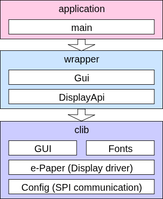

# Waveshare E-Ink Display - C++ Wrapper

## Architecture



The proposed architecture isolates the low level layers (already provided by waveshare), calling it from a C++ wrapper, solving some logic problems and allowing to add features without touching (or at least, reducing refactors) that low level code.

## Incrementals from original code

There are two parts of the wrapper:  

1. __The image generator (Gui):__
    - Added support for width-variable fonts: before it was only compatible with monospaced fonts.
    - Added a cursor when drawing characters, so, the program could know the position where the object ends, making easy to work with width-variable fonts.
    - Auto memory allocation for the image: now there is no need to operate with width and height and create manually an array.
    - Grouping interfaces in namespaces to keep clean code.
2. __The Display control (DisplayApi):__
    - Storing the status of the display like initialization mode, avoiding problems when using non-compatible functions with the operation mode.
    - Reducing the number of interfaces, calling the appropiate low-level function from a single upper-level method.

Also, the project is built using __CMake__.

## Added utils

- __scripts/font-generator.py__.  
Script for generating width-variable fonts. Requires Pillow module. Place a _.ttf_ font inside scripts/fonts and run the script:
    ```
    cd scripts
    python font-generator.py -fs=<font_size> -fn="<font_name.ttf>"
    ```
    Example:
    ```
    cd scripts
    # fonts/arial.ttf
    python font-generator.py -fs=44 -fn="arial.ttf"
    ```
    It will create the __output__ directory and place the __<font_name><font_size>.c__ file. This file must be placed manually in __src/clib/Fonts/__

    Including the font in the project requires adding the new file to _src/CMakeLists.txt_ and the extern reference in _inc/clib/Fonts/fonts.h_

## Aditional notes

The project is code-documented, and docs are auto-generated using Doxygen. The site link: https://ailr16.github.io/epd4in2v2-cpp/
